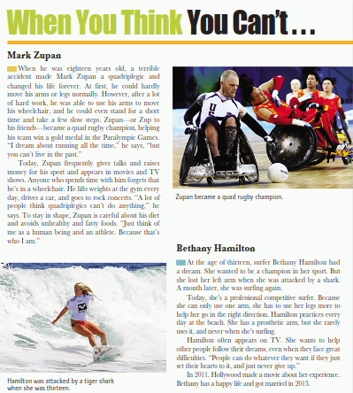

paraphrasing of the following text:

[Link al video](https://youtube.com/shorts/Hi7ZyAeccps?feature=share)

Mark Zupan suffered a tragic accident at the age of 18 that left him a quadriplegic and changed his life forever. However, with much effort and dedication, he managed to regain movement in his arms and turned his passion for quad rugby into a great success, helping his team win a gold medal at the Paralympic Games. Although he dreams of being able to run again, Zupan doesn't live in the past and keeps going, lifting weights, watching his diet and enjoying life like anyone else. He considers himself a human being and an athlete, and not just someone in a wheelchair.

<!-- Mark Zupan sufrió un trágico accidente a los 18 años que lo dejó tetrapléjico y cambió su vida para siempre. Sin embargo, con mucho esfuerzo y dedicación, logró recuperar el movimiento de sus brazos y convirtió su pasión por el quad rugby en un gran éxito, ayudando a su equipo a ganar una medalla de oro en los Juegos Paralímpicos. Aunque sueña con poder correr de nuevo, Zupan no vive en el pasado y sigue adelante, levantando pesas, cuidando su dieta y disfrutando de la vida como cualquier otra persona. Él se considera un ser humano y atleta, y no solo alguien en silla de ruedas. -->

